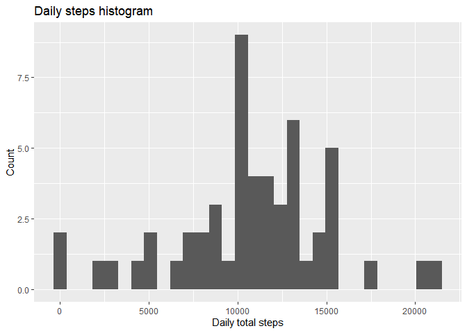
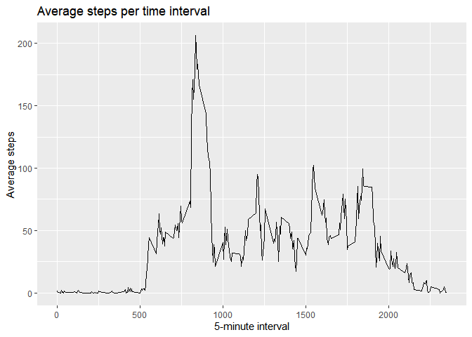
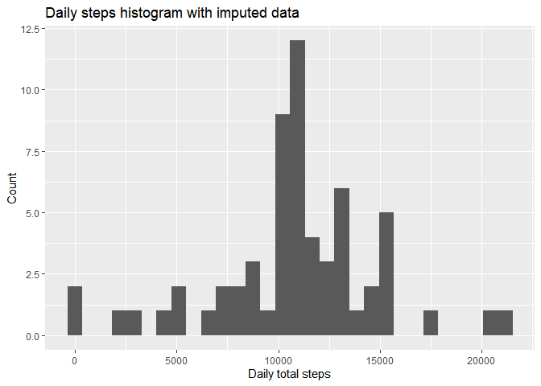
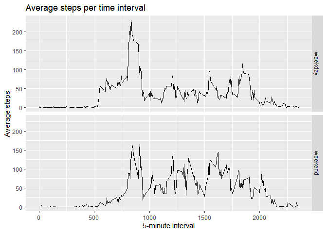

## Loading and preprocessing the data

The following code was used in order to unzip the dataset, load the data, and convert the "date" variabile to a date format.


```r
unzip("activity.zip")
activity <- read.csv("activity.csv")
activity[,"date"] <- as.Date(activity[,"date"], "%Y-%m-%d")
```


## What is mean total number of steps taken per day?

Next, the aggregate function was used in order to obtain the total steps averages per day, which are subsequently plotted in an histogram. Mean and median values are also computed.


```r
daySteps <- aggregate(activity[,"steps"],list(activity$date),sum)

library(ggplot2)
ggplot(daySteps,aes(x=x)) +
  geom_histogram() +
  labs(title="Daily steps histogram",x="Daily total steps", y = "Count")
```

<!-- -->

```r
dailyStepsMean <- mean(daySteps$x,na.rm = TRUE)
dailyStepsMedian <- median(daySteps$x,na.rm = TRUE)
```

The mean and median of the total number of steps taken per day are 1.0766189\times 10^{4} and 10765 respectively.


## What is the average daily activity pattern?

The following code compute the average steps taken per 5-minute interval during the day, averaged across all days, and display the results in a time series plot.


```r
intervalSteps <- aggregate(activity[,"steps"],list(activity$interval),mean,na.rm=TRUE)
ggplot(intervalSteps,aes(x=Group.1,y=x)) +
  geom_line() +
  labs(title="Average steps per time interval",x="5-minute interval", y = "Average steps")
```

<!-- -->

```r
maxStep <- intervalSteps[intervalSteps$x == max(intervalSteps$x),1]
```
Interval number 835 has the maximum number of steps daily, on average.


## Imputing missing values


```r
naRows <- sum(is.na(activity$steps))
```
There is a total of 2304 rows without steps data.

The following code obtains a version of the dataset where all NAs have been removed and filled in with the average value for the same interval.


```r
imputedActivity <- data.frame(activity)
for (row in 1:nrow(imputedActivity)) {
  if (is.na(imputedActivity[row,"steps"])) {
    imputedActivity[row,"steps"] <- intervalSteps[intervalSteps$Group.1==imputedActivity[row,"interval"],2]
  }
}
```
Now we plot the same histogram as before, with mean and median values.


```r
impDaySteps <- aggregate(imputedActivity[,"steps"],list(imputedActivity$date),sum)

ggplot(impDaySteps,aes(x=x)) +
  geom_histogram() +
  labs(title="Daily steps histogram with imputed data",x="Daily total steps", y = "Count")
```

<!-- -->

```r
mean(impDaySteps$x,na.rm = TRUE)
```

```
## [1] 10766.19
```

```r
median(impDaySteps$x,na.rm = TRUE)
```

```
## [1] 10766.19
```
Imputing data as indeed left the histogram pretty similar to the initial one, however the frequency have greatly changed. 


## Are there differences in activity patterns between weekdays and weekends?

Finally, the following code aggregates the data by weekdays/weekends and by intervals, and plot the differences between weekdays/weekends in terms of average steps distributions during different intervals.


```r
days <-  weekdays(imputedActivity[,"date"])
dayFactor <- days == "sabato" | days == "domenica"
imputedActivity[,"isWeekend"] <- as.factor(dayFactor)
levels(imputedActivity$isWeekend)<- c("weekday","weekend")

intervalStepsWdays <- aggregate(imputedActivity[,"steps"],
                                list(imputedActivity$interval,
                                     imputedActivity$isWeekend),
                                mean,na.rm=TRUE)

ggplot(intervalStepsWdays,aes(x=Group.1,y=x)) +
  geom_line() +
  labs(title="Average steps per time interval",x="5-minute interval", y = "Average steps") +
  facet_grid(Group.2~.)
```

<!-- -->


